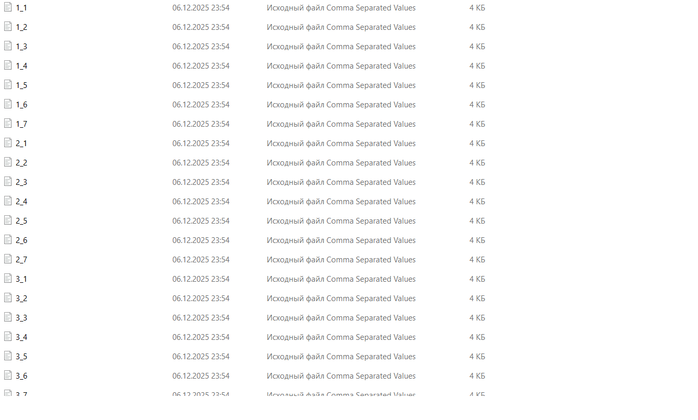
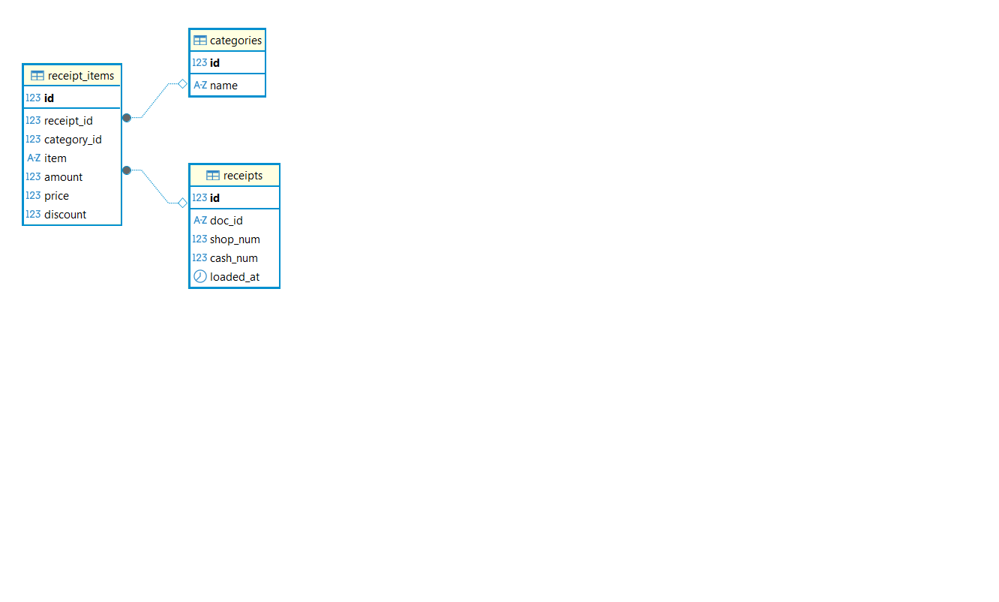
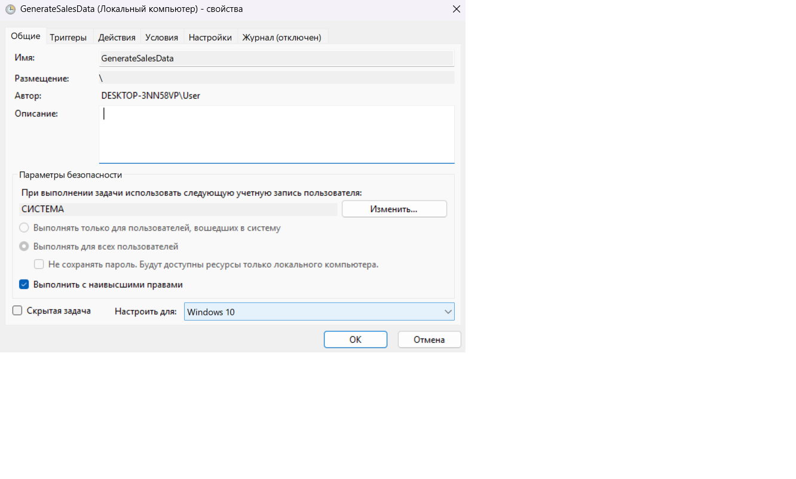
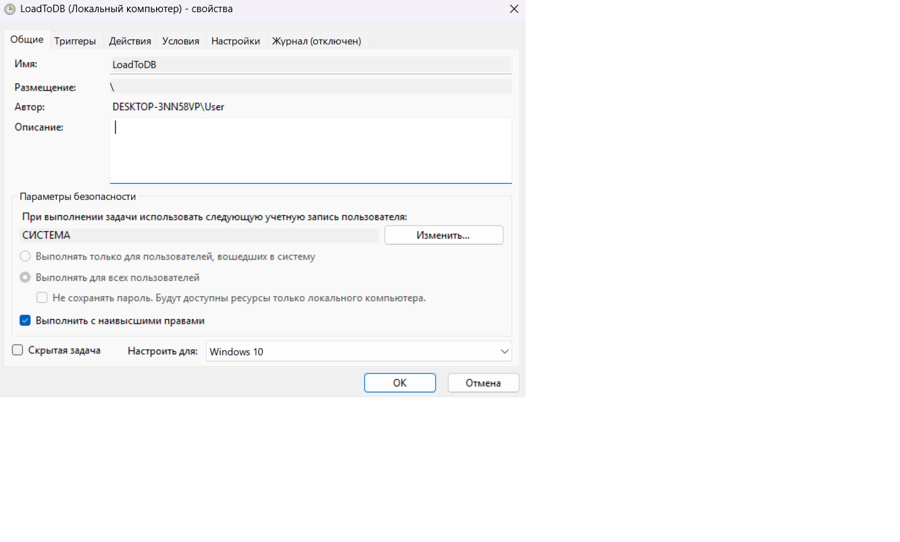
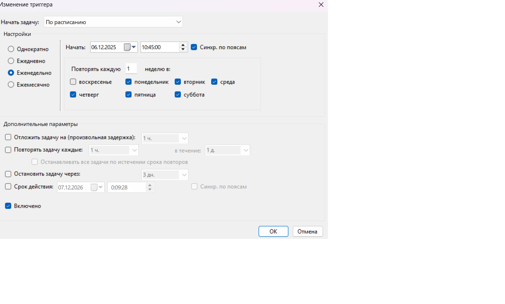

# Автоматизация обработки чеков торговой сети
## Описание проекта
Скрипт генерирует CSV-файлы с данными чеков и загружает их в PostgreSQL.    
Автоматизация через Планировщик заданий Windows (пн-сб, 09:00/09:30).

__Формат CSV__: doc_id,item,category,amount,price,discount    
## Требования
*   Windows 10/11
*   Python 3.11+
*   PostgreSQL 13+ (localhost:5432)
*   PowerShell (от администратора)
## Установка
1. Клонируйте репозиторий и  зайдите в папку, где лежит проект
```powershell
git clone https://github.com/yourusername/sales-automation.git
cd project_root
```
2. Создайте виртуальное окружение
В PowerShell перейди в папку project_root и создайте виртуальное окружение
```powershell
python -m venv .venv
```
После этого в project_root появится папка .venv с подкаталогом Scripts, где и будет python.exe.

3. Установите Python пакеты, находясь в виртуальном окружении 
```powershell
pip install -r requirements.txt
```
4. Создайте `config.env`. Для этого в блокноте заполните необходимые параментры:
```python
HOST=localhost
PORT=5432
DBNAME= #имя_вашей_БД
USER= #имя_пользователя
PASSWORD= #пароль
PROJECT_ROOT=C:\path\to\your\project # путь до папки с проектом
DATA_FOLDER=C:\path\to\your\project\data #путь до папки со сгенерированными csv-файлами
```
5. __ВАЖНО!__    
В указанных файлах замените путь на тот. где лежит проект (!!!):
*   config.py
```python
PROJECT_ROOT = os.getenv('PROJECT_ROOT', r"C:\Users\User\Downloads\SIMULATIVE\Final_project_Automatization\project_root") # ЗАМЕНИТЬ ПУТЬ ДО ПАПКИ
```
*   generate_dumps.py
```python
BASE_DIR = os.getenv('PROJECT_ROOT', r"C:\Users\User\Downloads\SIMULATIVE\Final_project_Automatization\project_root") # ЗАМЕНИТЬ ПУТЬ ДО ПАПКИ
```
*   run_generate.bat
```python
cd /d "C:\Users\User\Downloads\SIMULATIVE\Final_project_Automatization\project_root" # ЗАМЕНИТЬ ПУТЬ ДО ПАПКИ
```
*   run_database.bat
```python
cd /d "C:\Users\User\Downloads\SIMULATIVE\Final_project_Automatization\project_root" # ЗАМЕНИТЬ ПУТЬ ДО ПАПКИ
```
*   setup_tasks.ps1
```powershell
$project_path = "C:\Users\User\Downloads\SIMULATIVE\Final_project_Automatization\project_root" # ЗАМЕНИТЬ ПУТЬ ДО ПАПКИ
```
6. После того, как все пути изменены, перейдите в папку с проектом (выйти из окружения) и протестируйте скрипты
```powershell
# Генерация CSV

python generate_dumps.py
dir data\*.csv

# Загрузка в БД
python database.py
```
### Сгенерированные файлы CSV в папке `data`


### Созданные таблицы в БД

#### Описание таблиц:    
1. Таблица categories    
*   id – целочисленный первичный ключ, уникальный идентификатор категории.
*   name – текстовое название категории товара (например, «бытовая химия», «текстиль», «посуда»).

2. Таблица receipts
*   id – целочисленный первичный ключ, уникальный идентификатор чека в базе.
*   doc_id – строковый идентификатор чека из кассовой системы (из CSV), общий для всех строк одного чека.
*   shop_num – номер магазина, к которому относится чек.
*   cash_num – номер кассы в магазине.
*   loaded_at – дата и время загрузки этого чека в базу (когда скрипт занёс данные).

3. Таблица receipt_items
*   id – целочисленный первичный ключ, уникальный идентификатор позиции чека.
*   receipt_id – внешний ключ на receipts.id, указывает, к какому чеку относится эта строка.
*   category_id – внешний ключ на categories.id, указывает категорию товара.
*   item – название товара (как в файле CSV).
*   amount – количество единиц товара в этой строке чека.
*   price – цена одной единицы товара без учёта скидки.
*   discount – сумма скидки на одну единицу товара в этой строке (может быть 0).

## Автоматизация (Планировщик заданий)
__Запуск от администратора!__ (Win+X → PowerShell Администратор)
```powershell
# 1. Создать задачи (пн-сб, 09:00/09:30)
.\setup_tasks.ps1

# 2. Проверить статус
Get-ScheduledTask GenerateSalesData,LoadToDB
```
__Проверка__: Win+R → taskschd.msc
## Скриншоты автоматизации
1. GenerateSalesData → Свойства

2. GenerateSalesData → Триггеры

3. LoadToDB → Свойства

4. LoadToDB → Триггеры

